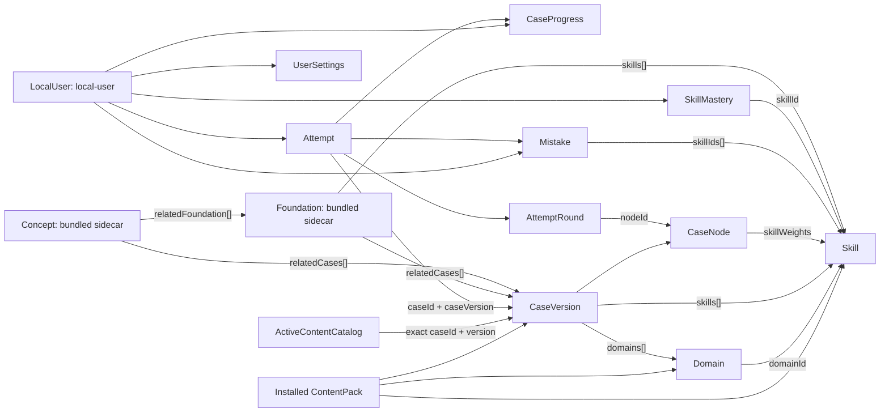
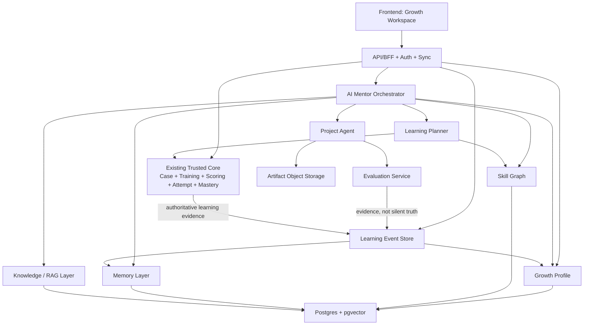

# FDE Arena Codebase Review

> 面向“AI Personal Growth OS”产品架构设计的现状审查
> 审查日期：2026-07-16
> 审查方式：只读代码、内容和配置分析；未修改应用代码，未运行构建、测试或数据迁移

## Executive Summary

FDE Arena 当前不是一个通用 AI 导师系统，而是一个完成度较高的、本地优先的 FDE 能力训练与确定性评估产品。它已经拥有稳定 ID、版本化 Case、分支训练、断点续练、评分、Mastery、错题、Debrief 和规则推荐组成的可信学习闭环。

产品的视觉和首页叙事已经开始接近“Growth OS”：有今日任务、等级、连续学习、能力雷达、薄弱项和学习路径。但数据和产品内核仍然是“作者编排内容 + 规则训练”，还没有真正的 AI Mentor、长期记忆、目标驱动规划、语义检索、项目制学习或 Agent 工具调用。

最重要的架构结论是：**不应推翻当前系统**。现有 Case/Attempt/Scoring/Mastery 应作为 V2 的“可信评估内核”，在其外围逐层增加 Growth Profile、Skill Graph、Learning Event、Plan、Memory、Project 以及受限制的 AI Agent ports。

### 当前内容基线

| 内容                               |                   当前数量 | 代码证据                                                    |
| ---------------------------------- | -------------------------: | ----------------------------------------------------------- |
| Active Case                        |                         50 | `content/manifests/content-config.json` 的 `activeCases`    |
| Case 版本                          |                         53 | `content/manifests/coverage-report.json` 的 `totalCases`    |
| Beginner / Intermediate / Advanced |               22 / 18 / 10 | `content/manifests/coverage-report.json` 的 `counts.levels` |
| Foundation                         |                        100 | `src/generated/foundation-index.ts`                         |
| Concept                            |                         50 | `src/generated/concept-index.ts`                            |
| Domain / Skill                     |                    15 / 15 | `src/generated/content-index.ts`                            |
| Content Pack                       | `fde-arena-bundled` v1.3.0 | `content/manifests/content-config.json`                     |

---

# 1. 项目技术架构分析

## 1.1 技术栈

| 领域        | 当前实现                                          | 关键证据                                                                                                 | 判断                                               |
| ----------- | ------------------------------------------------- | -------------------------------------------------------------------------------------------------------- | -------------------------------------------------- |
| 前端框架    | React 19.2.7 + TypeScript 6.0.3                   | `package.json`                                                                                           | 纯 SPA，没有 SSR/SSG 框架                          |
| 构建工具    | Vite 8.1.4                                        | `vite.config.ts`, `package.json`                                                                         | 输出静态前端产物                                   |
| 路由        | React Router DOM 7.18.1，`createHashRouter`       | `src/app/router.tsx`                                                                                     | Hash Router 适合无服务端 rewrite 的静态托管        |
| 后端框架    | 无                                                | 全项目未发现 Express/Next/Nest/Fastify 服务端入口                                                        | 当前所有业务在浏览器内执行                         |
| 数据库      | IndexedDB，通过 `idb` 8.0.3                       | `src/storage/database.ts`                                                                                | 本地优先、单设备、无云端同步                       |
| UI 组件库   | 自建 React 组件；Phosphor Icons                   | `src/components/ui/`, `@phosphor-icons/react`                                                            | 没有 MUI/Ant Design/Chakra/shadcn 运行时依赖       |
| CSS 方案    | 全局原生 CSS + Design Tokens                      | `src/styles/reset.css`, `tokens.css`, `global.css`                                                       | 非 Tailwind，非 CSS-in-JS                          |
| 状态管理    | React Context + Hooks + 局部 reducer + Repository | `src/app/App.tsx`, `src/application/product/runtime.tsx`, `src/application/training/training-reducer.ts` | 没有 Redux/Zustand/MobX                            |
| Schema 校验 | Zod 4.4.3 + JSON Schema/内容脚本                  | `src/content/schemas.ts`, `src/content/concept-schema.ts`, `scripts/validate-content.ts`                 | 内容进入运行时前有强校验                           |
| 测试        | Vitest + Testing Library + jsdom                  | `vite.config.ts`, `src/**/*.test.ts(x)`                                                                  | Playwright 已安装，但未发现可执行的 E2E 配置/用例  |
| 国际化      | 自建 `I18nProvider`，中英文词典                   | `src/i18n/`                                                                                              | 不依赖 i18next/react-intl                          |
| CI          | GitHub Actions                                    | `.github/workflows/ci.yml`                                                                               | 执行测试、内容检查、typecheck、lint、format、build |
| 部署        | 静态 `dist` 产物，未绑定云平台                    | `package.json` 的 `build`                                                                                | 未发现 Vercel/Netlify/Cloudflare/Docker 部署配置   |

## 1.2 API 与运行时架构

当前没有 HTTP API，也没有运行时 LLM API。项目的“API 边界”是 TypeScript 接口：

- `src/repositories/contracts/`：Case、Attempt、Progress、Mastery、Mistake、Settings 等持久化 ports。
- `src/repositories/indexeddb/`：这些 ports 的 IndexedDB adapters。
- `src/application/product/runtime.tsx`：通过 `ProductDataProvider` 向页面注入 repositories，页面不直接操作 IndexedDB。
- `src/content/contracts.ts`：`ContentSource` 和 `ContentPack` 边界，已预留 `bundled | file | url | database` 来源类型。
- `src/content/local-content-source.ts` 与 `src/content/json-file-content-source.ts`：当前已实现内置内容包和本地 JSON 文件导入。

这是一个有价值的可替换边界：V2 可以增加远程 repository adapter，而不需要让 Dashboard、Training 或 Debrief 直接依赖某个后端 SDK。

## 1.3 运行时组合

`src/app/App.tsx` 的实际 Provider 树为：

```text
I18nProvider
└─ ThemeProvider
   └─ ProductDataProvider
      └─ LearningJourneyProvider
         └─ RouterProvider
```

其中：

- 核心学习数据通过 IndexedDB 持久化。
- 语言由 `src/i18n/` 保存在 `localStorage`。
- Theme 由 `src/components/layout/ThemeProvider.tsx` 管理，但当前未读写 `SettingsRepository`，刷新后回到默认 dark。
- 新手起点、Foundation 访问记录和 First Mission 完成状态只存在 `LearningJourneyProvider` 的 React 内存中，刷新会丢失：`src/components/onboarding/LearningJourneyContext.tsx`。

因此，现在是“主要学习证据可持久化，产品偏好与 onboarding 状态分散”的混合模式。

---

# 2. 项目目录结构分析

## 2.1 主目录职责

```text
fde-arena/
├─ content/                    # 版本化学习内容，与页面代码分离
│  ├─ cases/                 # 按难度组织的 Case JSON
│  ├─ domains/               # Domain 定义
│  ├─ skills/                # Skill 定义
│  ├─ foundation/            # Foundation 知识单元
│  ├─ concepts/              # Foundation 与 Case 之间的 Concept 层
│  ├─ manifests/             # Content config/manifest/coverage report
│  └─ schemas/               # JSON Schema
├─ scripts/                    # 内容索引、校验、质量和覆盖检查
├─ src/
│  ├─ app/                   # App 组合、路由、route-level shell
│  ├─ application/           # 用例层：训练、推荐、产品分析、onboarding
│  ├─ components/            # 布局、题型、证据、概念和通用 UI
│  ├─ content/               # ContentSource、加载、安装、schema、migration
│  ├─ domain/                # 纯领域类型与确定性规则
│  ├─ generated/             # 脚本生成的 lazy content indexes
│  ├─ i18n/                  # 中英文词典与 provider
│  ├─ pages/                 # 路由页面
│  ├─ repositories/          # 持久化 contracts 和 IndexedDB adapters
│  ├─ schemas/               # 用户数据导入/导出 schema
│  ├─ storage/               # IndexedDB 建库与迁移
│  └─ styles/                # reset/tokens/global styles
├─ docs/                       # 架构、内容生产、UX 和评审文档
└─ .github/workflows/           # CI
```

## 2.2 `src` 内部分层

### Pages

`src/pages/` 一个目录对应一个产品模块：

- `dashboard/DashboardPage.tsx`：新用户引导和活跃用户 Mission Command Center。
- `foundation/`：Foundation 库与详情。
- `cases/CaseLibraryPage.tsx`：Case 搜索、筛选和状态。
- `training/`：先修知识门、训练会话和完成页。
- `debrief/DebriefPage.tsx`：正确路径、用户路径、证据和下一步。
- `skills/SkillsPage.tsx`：Domain/Skill Mastery 地图。
- `mistakes/MistakesPage.tsx`：错题与重练入口。
- `profile/ProfilePage.tsx`：实际上是“能力报告”，不是完整的用户账户页。
- `settings/SettingsPage.tsx`：语言、内容包信息、导入导出与数据重置；主题切换器位于全局 Context Bar。

### Components

`src/components/` 是按产品语义而不是单纯原子层级划分：

- `layout/`：Application Shell、Training Shell、Mobile Navigation、Theme。
- `question/`：12 类封闭题型的组件实现。
- `case/`：Case 训练布局和场景呈现。
- `evidence/`：证据面板。
- `scoring/`：评分/反馈呈现。
- `concept/`：Concept 卡片和桥接显示。
- `onboarding/`：起点选择、First Mission、Roadmap 与 Learning Journey Context。
- `ui/`：按钮、标签、面板等基础组件。

### Application / Domain / Repository

```text
Page / Component
      |
      v
application/* use case
      |
      +----> domain/* pure rule
      |
      +----> repository contract
                 |
                 v
          IndexedDB adapter
```

具体例子：

- `src/application/training/training-service.ts` 组织 Attempt 建立、作答、checkpoint 和完成事务。
- `src/domain/scoring/` 保持确定性评分，不需要页面环境。
- `src/repositories/contracts/models.ts` 定义用户数据和版本化内容记录。
- `src/repositories/indexeddb/progress-repository.ts` 将 Attempt/Progress/Mastery/Mistake 作为一个完成快照原子提交。
- `src/architecture/content-boundaries.test.ts` 防止页面绕过内容/数据边界直接 import。

## 2.3 路由设计

`src/app/router.tsx` 使用静态 import，当前没有 route-level lazy loading。实际路由树为：

```text
Hash Router
└─ /
   ├─ /training                    # 独立 TrainingShell
   │  ├─ index                       # Training landing
   │  └─ /training/:caseId           # Concept/Foundation 先修门 + Session
   └─ ApplicationShell
      ├─ /                           # Dashboard
      ├─ /foundation                 # Foundation Library
      ├─ /foundation/:foundationId   # Foundation Detail
      ├─ /cases                      # Case Library
      ├─ /skills                     # Skill Map
      ├─ /mistakes                   # Mistake Book
      ├─ /profile                    # Capability Profile
      ├─ /settings                   # Preferences + Content/Data operations
      └─ /debrief/:attemptId         # Attempt Debrief
```

Concept 目前没有独立 route；它作为 Foundation 与 Training prerequisite 中的嵌入式认知桥梁。

需要区分两类拆包：`src/generated/content-index.ts`、`src/generated/foundation-index.ts` 和 `src/generated/concept-index.ts` 已使用动态 `import()` 延迟加载大量 JSON 内容；但页面组件仍在 router 中静态导入。因此内容层已有 code splitting，路由 UI 层仍有后续优化空间。

---

# 3. 当前产品信息架构

## 3.1 用户可见模块

```text
FDE Arena
├─ Dashboard / Mission Command Center
│  ├─ New User Onboarding
│  │  ├─ Starting Point
│  │  ├─ First Mission
│  │  └─ Learning Roadmap
│  └─ Active Learner Dashboard
│     ├─ Today Mission
│     ├─ Learning Paths
│     ├─ Level / XP / Streak
│     ├─ Capability Radar
│     └─ Weak Skills / Recent Mistakes
├─ Foundation Knowledge
│  ├─ Library
│  ├─ Knowledge Detail
│  └─ Related Concept / Skill / Case
├─ Concepts                         # 嵌入式，无独立一级导航
├─ Real Cases
│  ├─ Search / Filter / Progress
│  └─ Start / Resume / Retrain
├─ Training
│  ├─ Prerequisite Knowledge Gate
│  ├─ Scenario + Evidence + Decision
│  └─ Deterministic Feedback / Branching
├─ Debrief
│  ├─ Score / Verdict
│  ├─ Actual vs Correct Path
│  └─ Root Cause / Fix / Validation / Next Case
├─ Skills
│  └─ Domain / Mastery / Weakness
├─ Mistakes
│  └─ Error Evidence / Retraining
├─ Capability Profile
└─ Settings
```

## 3.2 主要用户路径

### 新用户学习旅程

```text
首次进入
  → 选择起点
  → 理解 Foundation → Concept → Case → Mastery 方法
  → First Mission
  → 阅读 Foundation
  → 理解 Concept
  → 进入 Case
  → 完成 Training
  → Debrief
  → Mastery / 下一任务
```

### 活跃用户日常闭环

```text
Dashboard Today Mission
  → 推荐 Case
  → 先修知识检查
  → 分支训练
  → 评分 + 错题 + Mastery 原子更新
  → Debrief
  → 新的薄弱项与明日推荐
```

### 纠错路径

```text
Mistakes
  → 查看原 CaseVersion / Node / Evidence
  → 重训同 Case
  → 通过后续 Attempt 推导改善
```

## 3.3 当前信息架构的优点

1. **从知识到证据的闭环完整**：Foundation/Concept 不直接等于 Mastery，必须通过 Case 证据验证。
2. **Training 有独立 Shell**：训练时减少常规导航干扰，且桌面端突出场景、证据和决策。
3. **首页已经是任务导向，而非课程目录导向**：`buildDailyTrainingPlan()` 使“今天做什么”成为主操作。
4. **用户可回看原始学习证据**：Attempt 保留每轮提交、评价、访问节点和当时 CaseVersion。

## 3.4 当前信息架构的主要问题

1. **Concept 可发现性弱**：没有独立导航或索引，用户主要在 Foundation/Training 中被动遇到它。
2. **Profile 命名与实际内容不一致**：`ProfilePage` 是能力报告，没有身份、目标、项目或偏好管理。
3. **Skills 与 Profile 信息重叠**：两者都在解释能力、Domain 和薄弱项，但没有明确区分“地图”与“我的证据报告”。
4. **Settings 混合了偏好和内容运维**：语言偏好与 Content Pack 导入、数据导出/重置在同一信息层。
5. **新手旅程状态未持久化**：刷新后起点选择和 First Mission 记录消失，会破坏连续性。

---

# 4. 页面 UI 布局分析

## 4.1 全局 Shell

`src/components/layout/ApplicationShell.tsx` 和 `src/styles/global.css` 定义了实际布局。

### 桌面端（≥64rem）

```text
┌──────────────────────────────────────────────────────────────────┐
│ 264px Sidebar  │ Context Bar: status / search / language / theme  │
│                ├─────────────────────────────────────────────────┤
│ Brand          │                                                │
│ Dashboard      │       Workspace Main (max 1500px)             │
│ Foundation     │                                                │
│ Cases          │       Route Page                               │
│ Skills         │                                                │
│ Mistakes       │                                                │
│ Profile        │                                                │
│ Settings       │                                                │
│                │                                                │
│ Local Ready    │                                                │
└────────────────┴─────────────────────────────────────────────────┘
```

- Sidebar 宽度由 `src/styles/tokens.css` 的 `--sidebar-width: 16.5rem` 确定。
- Context bar 保持 sticky，搜索会跳到 `/cases?q=...`。
- Main content 上限为 `--content-max: 93.75rem`。
- 导航有 skip link、`aria-current`、焦点样式，移动 drawer 有焦点管理，可访问性基础较好。

### 移动端

```text
┌─────────────────────┐
│ Sticky Context Bar  │
├─────────────────────┤
│                     │
│ Main route content  │
│                     │
├─────────────────────┤
│ Home Cases Training │
│ Skills More         │
└─────────────────────┘
```

Foundation 在移动端被收进 More，而 Training 占据底部一级导航。这符合“训练优先”，但与新用户需要先学 Foundation 的路径存在一定张力。

## 4.2 首页布局

### Active Learner Dashboard

`src/pages/dashboard/DashboardPage.tsx` 的活跃用户布局是一个 Mission Command Center：

```text
┌──────────────────── Main Column ──────────────────────────────────────┬── Right Rail ───────┐
│ Hero: value proposition + primary/secondary CTA + SVG scene        │ Level / XP / Streak │
├──────────────────────────────────────────────────────────────────────┤ Capability Radar    │
│ Today Mission: scenario / difficulty / time / skill / action       │ Activity / Metrics  │
├───────────────────────────────────────────────────────────────────────┤ Weak Skills         │
│ Foundation Learning Paths                                         │ Recent Mistakes     │
├────────────────────────────────────────────────────────────────────────┴─────────────────────┤
│ Achievements / Domain Coverage                                      │
└───────────────────────────────────────────────────────────────────────────────────────┘
```

- 屏幕宽度达到 80rem 时，`global.css` 才把 Dashboard 分为主列 + 19–21rem 右栏。
- Hero 最小高度约 28–31rem，故在普通笔记本高度上，Today Mission 可能落到首屏之下。
- Hero 主 CTA 与 Mission 的进入按钮功能部分重复，会分散“今天只做什么”的焦点。
- Card 有统一的 surface/border/radius/shadow tokens，信息层级主要靠大型 Hero、accent gradient、eyebrow 和 panel 组合建立。

### New User Dashboard

新用户模式会将以下内容提到主层级：

1. 欢迎语与学习方法。
2. 零基础/有技术基础/直接实战的起点选择。
3. Foundation → Concept → Case → Mastery 的四步法。
4. First Mission 和四阶段 Roadmap。
5. 已有活跃用户 Dashboard 收入 `Explore later` disclosure，降低新用户信息过载。

这个模式的意图是正确的：先解答“从哪里开始、为什么学、下一步做什么”，而不是向新手一次性展示所有能力仪表。

## 4.3 Training UI

桌面端 Training 使用 `26% / 40% / 34%` 三列：

```text
┌───────────────┬───────────────────────┬───────────────────┐
│ Scenario 26%  │ Evidence 40%          │ Decision 34%      │
│ context/risk  │ logs/docs/observations  │ question/actions   │
│                │ scrollable              │ sticky/scrollable │
└───────────────┴───────────────────────┴───────────────────┘
```

这个布局把 FDE 的核心工作模式“理解场景 → 检查证据 → 做决策”直接编码进界面，是当前产品最有辨识度的 UI 结构。

---

# 5. 当前设计理念判断

## 选择：A. LMS 课程/训练平台（更精确地说：能力与情境模拟导向的 LMS）

它不是传统视频课程型 LMS，但从当前数据和用户闭环看，最接近 A：

- 学习对象是作者预先编排的 Foundation、Concept 和 Case。
- 用户完成封闭式训练，系统按确定性规则评分。
- 进度、Mastery、错题和 Debrief 都围绕这些内容单元建立。
- 个性化是基于历史证据的规则排序，而不是导师对话和目标约束规划。

### 为什么不是 B. 知识管理系统

Foundation/Concept 有知识库特征，但用户不能捕获、编辑、连接或生产自己的知识。知识是训练内容，而不是用户的工作空间。

### 为什么不是 C. AI 学习助手

项目中没有运行时 LLM、对话、RAG、自然语言诊断、tool calling 或 agent trace。“AI/Agent/RAG”主要是学习内容的主题，不是产品的智能运行时。

### 为什么还不是 D. Personal Growth OS

当前系统没有长期目标、职业/生活项目、习惯、产出物、持续记忆、跨域学习事件和可动态重排的成长计划。首页是 Growth OS 的视觉雏形，但数据内核还不是。

---

# 6. 核心数据模型分析

## 6.1 内容模型

### Case

`src/domain/cases/types.ts` 中的 `FdeCase` 是版本化的情境评估图，关键元数据包括：

- 稳定 `id`、`version`、`schemaVersion`、`status`。
- `domains[]` 与 `skills[]`。
- scenario、evidence、node graph、branches、consequences。
- correct path、root cause、fix、validation 等 Debrief 资料。

`CaseNode` 是封闭联合类型，当前精确包含 12 种 `NodeType`：单选、判断、日志分析、命令选择、Diff Review、Configuration Review、Architecture Trade-off、Customer Response、多选、排序、Matching 和 Evidence Conclusion。每个节点可用 `skillWeights` 把证据归因到 Skill。

### Content Pack

`src/content/contracts.ts` 定义：

```text
ContentPack
├─ manifest
├─ cases
├─ skills
├─ domains
└─ coverage
```

当前 Foundation 与 Concept **不在 ContentPack 中**；它们由 `src/content/foundation-source.ts` 和 `src/content/concept-source.ts` 从 bundled generated index 单独加载。这意味着：如果未来导入一个与内置题库不同的 Case/Skill/Domain pack，仍可能显示内置 Foundation/Concept，两者关系可能失配。

## 6.2 用户与学习证据模型

`src/repositories/contracts/models.ts` 是当前用户数据的主要真相来源。

| 模型                         | 作用                        | 重要语义                                                                                 |
| ---------------------------- | --------------------------- | ---------------------------------------------------------------------------------------- |
| `LocalUser`                  | 本地用户占位                | 固定 `local-user`，只有 displayName/createdAt；运行时尚未形成真正 Profile                |
| `AttemptRecord`              | 一次训练的事实记录          | 指向精确 `(caseId, caseVersion)`，保留 round history、visited nodes、consequences、score |
| `CaseProgressRecord`         | 每个 Case 的快照            | 最高/最新分数、完成数、是否出现关键错误                                                  |
| `SkillMasteryRecord`         | 每个 Skill 的当前分数       | 分数、样本数、更新时间；尚无 estimatorVersion/provenance/confidence                      |
| `MistakeRecord`              | 每个错误 round 的可回溯证据 | 指向 Attempt/CaseVersion/Node，保留提交、正解、错误类型、证据与 Skill                    |
| `UserSettings`               | 用户偏好                    | 当前主要是 theme                                                                         |
| `InstalledContentPackRecord` | 已安装内容快照              | 保存 manifest/domain/skill/coverage，支持解释历史 Attempt                                |

## 6.3 当前数据关系图



## 6.4 IndexedDB 结构与数据流

`src/storage/database.ts` 定义数据库 `fde-arena` v2，当前 stores：

```text
caseVersions
attempts
progress
mastery
mistakes
settings
coverage
appMeta
contentPacks
```

`src/storage/migrations.ts` 从 v1 到 v2 仅新增 `contentPacks`，是 additive migration。

核心数据流：

```text
checked-in content
  → generated indexes
  → LocalContentSource / JsonFileContentSource
  → validate + hash + conflict check
  → IndexedDB transaction:
      caseVersions + contentPacks + active-content-catalog

active catalog
  → exact CaseVersion
  → create/resume in-progress Attempt
  → submitNode → deterministic evaluation/scoring
  → checkpoint Attempt
  → terminal transaction:
      completed Attempt + Progress + Mastery + Mistakes
  → Dashboard / Skills / Mistakes / Profile / Debrief
```

## 6.5 当前学习算法

### Mastery

`src/application/training/training-service.ts` 先按 Node `skillWeights` 聚合本次 Case 的 Skill 证据；`src/domain/mastery/update-mastery.ts` 再以下列规则更新：

```text
new mastery = previous * 0.70 + current evidence * 0.30
```

如本次存在 critical error，当次证据分封顶为 40。该算法简洁、可解释、可 replay，但还没有：

- 时间衰减/遗忘曲线。
- 难度校准。
- 样本不确定性或置信度。
- 算法版本和证据 provenance。

### Daily Plan

`src/application/product/catalog.ts` 的 `buildDailyTrainingPlan()` 最多输出 3 项，优先级大致为：

```text
未解决关键错误
  → 薄弱 Skill
  → 近期失败
  → 新掌握能力的迁移验证
  → 未完成 Case
  → stable fallback
```

它是有效的规则推荐 baseline，但不是完整的学习计划：没有 Goal、deadline、时间预算、依赖图、计划版本和 replan trigger。

## 6.6 数据模型的主要架构债务

1. **Foundation/Concept 与 ContentPack 脱节**：它们没有跟 active pack 一起版本化安装。
2. **聚合学习估计的版本不足**：Attempt 保留完整原始证据；Mistake 也有 Attempt/CaseVersion/Node/Evidence 引用，Progress 有 `latestAttemptId`。但 Mastery 只保存分数和样本数，没有 evidence IDs、estimatorVersion 或可解释的估计来源；Progress/Mistake 也没有自身 schemaVersion。
3. **`LocalUser` 尚未进入产品主流**：`ProductRepositories` 未暴露 user repository，常规业务直接使用 `LOCAL_USER_ID`。
4. **持久化分散**：语言用 localStorage，onboarding 用 React memory，学习证据用 IndexedDB，导出包不包含全部成长状态。
5. **无跨设备身份与同步**：无后端、冲突解决、outbox 或远程备份。
6. **Domain/Skill 激活状态仍有重复投影**：`DomainDefinition.status` 和 `SkillDefinition.status` 表达内容状态，但 `ActiveContentCatalog` 同时持久化 `activeDomainIds` / `activeSkillIds`，`src/repositories/indexeddb/content-repository.ts` 会直接读取这两个数组。当前 installer 会从 status 派生数组，因此不是人工维护的第二份内容，但它仍是一份可能漂移的持久化副本。

---

# 7. 与 DeepTutor / AI Mentor 能力范式的差距

> 本节比较的是用户提出的能力范式，不对某一外部产品的具体实现作事实断言。

## 7.1 当前已有

| 能力           | 完成度 | 现状                                                                  |
| -------------- | ------ | --------------------------------------------------------------------- |
| 版本化学习内容 | ✔ 强   | 稳定 ID、CaseVersion、Manifest、Content Pack、安装校验                |
| 学习闭环       | ✔ 强   | Foundation → Concept → Case → Training → Mastery/Debrief              |
| 情境化训练     | ✔ 强   | 场景、证据、分支、关键错误、正确路径                                  |
| 能力证据       | ✔ 强   | Node → skillWeights → Mastery，Attempt 保留详细作答记录               |
| 断点续练       | ✔ 强   | in-progress Attempt 可恢复，且绑定原 CaseVersion                      |
| 错题与复盘     | ✔ 强   | Mistake、正确答案、证据、根因/修复/验证、重练                         |
| 个性化推荐     | ◐ 部分 | 根据薄弱项、关键错误、失败和未完成 Case 生成 Top 3                    |
| Skill Graph    | ◐ 部分 | 实际为 Domain → Skill 和内容标签，没有显式 prerequisite/transfer edge |
| 长期学习记录   | ◐ 部分 | IndexedDB 保留 Attempt/Mastery，但这不等于可检索、可纠正的导师记忆    |

## 7.2 明确缺失

| 目标能力               | 当前缺口                                                                               | 对用户体验的影响                                       |
| ---------------------- | -------------------------------------------------------------------------------------- | ------------------------------------------------------ |
| AI Mentor              | 无导师对话、持久目标、行动承诺、周期回顾或跨会话摘要                                   | 系统能说“下一题做什么”，不能理解“为什么这个人现在要学” |
| Deep Tutoring          | 无自然语言问诊、苏格拉底追问、动态重讲和语义诊断                                       | 只能在作者预设的封闭分支中反馈                         |
| Long-term Memory       | 无 working/episodic/semantic memory 分层、写入策略、召回、来源、置信度、过期和用户纠正 | 过去经验无法成为导师下次对话的上下文                   |
| Dynamic Learning Plan  | 无 Goal → Gap → Prerequisite → Step 图，无时间预算、deadline、计划版本和 replan        | 今日计划是排序结果，不是可协商的成长路线               |
| Agent Tutor            | 无 LLM runtime、planner、tool calling、reflection、agent trace 和权限边界              | 无法自主搜索、准备资料、运行工具或跟进任务             |
| Knowledge/RAG          | 无运行时语义索引、向量库、引用和权限过滤                                               | AI/RAG 只是题库主题，不是系统能力                      |
| Project-based Learning | 无 Project/Milestone/Artifact/Rubric/版本迭代                                          | 用户只完成一次性模拟，不能围绕长周期真实产出成长       |
| AI Evaluation          | 无开放产出评分、rubric、引用、人工复核或 model/prompt version                          | 只能评估封闭 NodeSubmission                            |
| 云端身份/同步          | 无 auth、backend、sync、conflict resolution                                            | 无跨设备连续性，也无法支持导师后台任务                 |

## 7.3 一个重要的语义区分

```text
当前持久历史 ≠ AI 长期记忆
当前 Top 3 推荐 ≠ 动态学习计划
当前 Domain/Skill 标签 ≠ 可推理 Skill Graph
当前分支 Case ≠ 对话式 AI Tutor
当前一次性模拟 ≠ 长周期 Project-based Learning
```

这些能力都有可复用的现有基础，但不应在产品命名上把“有基础”描述成“已实现”。

---

# 8. 未来 V2：AI Personal Growth OS 架构建议

## 8.1 设计原则

1. **保留确定性评估内核**：AI 不得改写 Case 正解、历史 Attempt 或冒充正式 Mastery 证据。
2. **先建数据闭环，再加 Agent**：没有 Goal、Event、Plan、Memory provenance 时，上 LLM 只会产生不可回溯的聊天体验。
3. **AI 输出默认是 proposal**：计划修改、记忆写入、任务创建和能力评估都需结构化校验与用户确认。
4. **本地优先可以继续保留**：通过 repository adapters/outbox 增加同步，不让页面直接绑定后端。
5. **所有智能结论必须能回到证据**：证据 ID、内容版本、model/prompt/policy version 和用户更正必须可追溯。

## 8.2 目标分层架构



## 8.3 Frontend Layer

建议继续保留 React/Vite SPA，不因“要做 AI”就先重写为 Next.js。只有当公开内容 SEO、服务端渲染或 edge auth 成为真实需求时，才评估框架迁移。

V2 前端可增加：

- `Goals`：目标、期限、每周时间、目标 Skill/成果。
- `Learning Plan`：可解释的步骤、依赖、due date、完成条件和调整原因。
- `Mentor`：带引用的对话、诊断和 plan patch，而不是无边界聊天。
- `Projects`：Milestone、Artifact、反馈、Rubric 和版本迭代。
- `Evidence Timeline`：解释 Mastery 为什么变化。
- `Memory Controls`：查看、纠正、忘记、设置过期和禁用某类记忆。

## 8.4 Backend Layer

建议增加 TypeScript API/BFF，但应通过现有 repository contracts 的远程 adapter 接入。初始基础设施可为：

- PostgreSQL：用户、Goal、Plan、Project、内容版本、审计事件。
- pgvector：语义知识和可控 Memory 检索；避免过早引入独立向量库。
- Object Storage：Project Artifact、文档、代码包和评估附件。
- Queue/Worker：内容索引、摘要、评估和长时 Agent job。
- Outbox/Sync：IndexedDB 离线写入后幂等推送，服务端以 event ID 去重。

## 8.5 AI Agent Layer

不应把 LLM 调用直接放进 `training-reducer.ts`。建议定义独立 ports：

```ts
interface TutorPort {
  diagnose(input: TutorDiagnosisInput): Promise<TutorProposal>;
  explain(input: ExplanationInput): Promise<CitedExplanation>;
}

interface PlannerPort {
  proposePlan(input: PlanningContext): Promise<LearningPlanProposal>;
  proposePatch(input: ReplanContext): Promise<LearningPlanPatch>;
}
```

应用层负责：

1. 对 AI 输出做 schema 校验。
2. 核对引用的 Content/Attempt/Evidence ID。
3. 执行工具权限和数据最小化。
4. 将计划/记忆变更展示给用户确认。
5. 记录 model、prompt、policy、tool 版本和 agent trace。

## 8.6 Knowledge Layer

现有 Content Pack 可以演化为版本化 `KnowledgePack` 或 `LearningGraphSnapshot`：

```text
Foundation --teaches--> Skill
Concept --explains--> Skill / Foundation
Skill --prerequisite-of--> Skill
Case --assesses--> Skill
Case --remediates--> Skill
Skill --transfers-to--> Skill
Project --requires--> Skill
```

重点是增加有类型的 edge、来源和版本，而不是立刻重写现有 100 Foundation、50 Concept 和 50 Case。

RAG 层应强制：

- chunk 与原文版本绑定。
- 回答带引用和可见来源。
- 用户/组织权限在 retrieval 前过滤。
- 评分标准与生成解释分离。

## 8.7 Memory Layer

建议区分三类 Memory：

| 类型                    | 内容                                     | 默认策略                                                |
| ----------------------- | ---------------------------------------- | ------------------------------------------------------- |
| Working Memory          | 当前会话、当前 Case/Project 上下文       | 短期，会话结束后摘要或丢弃                              |
| Episodic Memory         | 完成某 Case、某次反思、某个 Project 事件 | 引用 LearningEvent，可查看和删除                        |
| Semantic/Profile Memory | 稳定目标、偏好、限制、反复出现的模式     | 需 provenance/confidence/consent/expiresAt/supersededBy |

Memory 不得直接等同于原始 Attempt：Attempt 是不可静默改写的事实，Memory 是可被纠正、过期和删除的导师上下文。

## 8.8 Learning / Project / Evaluation Layer

### Learning Planner

先实现确定性 planner：

```text
Goal
  → target outcomes
  → skill gaps
  → prerequisite ordering
  → Foundation / Concept / Case / Review / Project steps
  → weekly time budget
  → completion evidence
  → replan on fail / expiry / goal change
```

`buildDailyTrainingPlan()` 可作为离线 baseline/candidate generator，然后再让 AI 对规划提交带解释的 patch。

### Project Agent

新增模型：

```text
Project
├─ Goal / target Skills
├─ Milestones
├─ Artifacts (versioned)
├─ Feedback
├─ Rubric
└─ Evidence links
```

Agent 可以帮助分解里程碑、给反馈和提出下一步，但不应在没有 rubric/引用/人工覆写机制时直接把开放产出转成高风险能力认证。

### Evaluation

应将以下指标分开：

- Case correctness：现有确定性评分。
- Mastery estimate：保存 evidence IDs + estimatorVersion。
- Retention：间隔后复测。
- Transfer：新场景/新项目中的能力迁移。
- Project rubric：产出物级评估和人工覆写。
- Tutor quality：引用正确性、建议接受率、计划完成率与学习效果，不用“用户聊了多久”替代效果。

## 8.9 建议的新模型

```text
GrowthProfile
Goal
SkillEdge
LearningEvent
MasteryEvidence
LearningPlan
LearningPlanStep
ReviewSchedule
Project
Milestone
Artifact
RubricAssessment
MemoryItem
MentorSession
AgentRun
SyncOutboxItem
```

每个可演进模型都应有 stable ID、schemaVersion、createdAt/updatedAt，评估类模型还应有 evidenceIds、algorithm/model version 和 provenance。

## 8.10 保留、扩展与延后重构

| 处理       | 模块                                  | 原因                                                 |
| ---------- | ------------------------------------- | ---------------------------------------------------- |
| 保留       | `src/domain/scoring/`                 | 纯、确定、可测试的评分真相                           |
| 保留       | `src/application/training/`           | 已有断点、分支、事务完成和版本回放                   |
| 保留       | Attempt + CaseVersion                 | 是后续所有能力分析的可信证据                         |
| 保留并扩展 | Content Pack/Installer                | 已有校验、hash、冲突检查和原子安装                   |
| 扩展       | Repository contracts                  | 增加远程/composite adapters，保持页面与后端解耦      |
| 扩展       | Skill/Concept graph                   | 增加 typed edges、前置、迁移与版本快照               |
| 扩展       | Dashboard                             | 从今日 Case 发展为 Goal/Plan/Project/Evidence 工作台 |
| 延后重构   | React/Vite 框架                       | 当前不是核心瓶颈，重写不会自动带来 Growth OS         |
| 不应改写   | Training reducer 为 LLM state machine | 会破坏可回放性、测试性和正式评分信任                 |

## 8.11 分阶段迁移路线

### V2.0 — Growth Data Foundation

- 以 additive IndexedDB migration 新增 Goal、LearningEvent、Plan/Step、ReviewSchedule、MasteryEvidence。
- 持久化 onboarding 起点、学习旅程与完整 settings。
- 将 Foundation/Concept 纳入版本化 KnowledgePack 或与 ContentPack 建立显式兼容绑定。
- 以 Domain/Skill 自身 `status` 作唯一真相，active ID 列表只在读取边界即时派生，不再作可独立漂移的持久状态。
- 不加 AI，先确保事件和证据可 replay。

### V2.1 — Deterministic Personalized Learning

- 建立 PlannerPort 和 Goal → Skill Gap → Step 的约束规划。
- 增加间隔复习、明确的 Mistake resolution 和计划效果度量。
- 保留 `buildDailyTrainingPlan()` 作 baseline。

### V2.2 — Optional Cloud Sync

- 引入身份、API、outbox、幂等同步、冲突策略、删除和数据导出。
- 保留 IndexedDB 作离线缓存/本地写入层。

### V2.3 — AI Mentor

- 先上带引用的解释、诊断和 plan patch。
- AI 不接管正式 Case 评分，不直接写 learner truth。
- 记录所有记忆写入、工具调用和用户确认。

### V2.4 — Project-based Learning

- 引入 Project/Milestone/Artifact/Rubric。
- 使 Case 训练成为项目前的训练和项目后的补救资源。
- 在有可追溯 rubric 和人工升级通道后再使用 AI 辅助评估。

### V2.5 — Controlled Agent Automation

- 只对低风险、可回滚、有审计记录的任务放开有限工具权限。
- 建立 prompt-injection、数据泄露、越权、费用和时间预算边界。

---

# 9. 关键结论与下一步决策

## 9.1 可以直接保留的产品资产

- 50 个版本化实战 Case 和内容生产链。
- 100 Foundation + 50 Concept 的认知桥梁。
- 情境/证据/决策三列 Training UI。
- 确定性评分、关键错误和可回放 Attempt。
- Mastery、Mistakes、Debrief 和今日任务组成的最小闭环。
- ContentSource/Repository 边界与本地优先策略。

## 9.2 从“学习平台”迁移到“Growth OS”的第一关键步

第一步不是做聊天窗口，而是建立以下可追溯链条：

```text
User Goal
  → Target Skill Graph
  → Versioned Learning Plan
  → Learning / Project Events
  → Evidence-backed Evaluation
  → Mastery & Memory update
  → Explainable Replan
```

只有这条链存在，AI Mentor 才能成为成长系统的编排器，而不是悬浮在现有站点上的通用聊天机器人。

## 9.3 建议的产品定位表述

当前可准确表述为：

> FDE Arena 是一个以真实 AI 工程场景为核心的、本地优先的能力训练与证据化成长系统。

当完成 Goal/Plan/Event/Memory/Project 与 AI Mentor 闭环后，再升级为：

> AI Personal Growth OS：基于个人目标、能力证据、长期记忆和真实项目，持续规划、辅导、评估并调整成长路径。

---

# 审查证据索引

## 主要代码路径

- 技术栈与脚本：`package.json`
- App 组合：`src/app/App.tsx`
- 页面路由：`src/app/router.tsx`
- 全局 Shell：`src/components/layout/ApplicationShell.tsx`
- 首页：`src/pages/dashboard/DashboardPage.tsx`, `src/pages/dashboard/DashboardVisuals.tsx`
- Training 页：`src/pages/training/TrainingRoutePage.tsx`, `src/pages/training/TrainingSessionPage.tsx`
- Training 用例：`src/application/training/training-service.ts`, `training-reducer.ts`
- 评分：`src/domain/scoring/`
- Mastery：`src/domain/mastery/update-mastery.ts`
- 产品分析/推荐：`src/application/product/analysis.ts`, `catalog.ts`
- Case 模型：`src/domain/cases/types.ts`
- Foundation/Concept 模型：`src/domain/foundation/types.ts`, `src/domain/concepts/types.ts`
- Content Pack：`src/content/contracts.ts`, `src/content/installer.ts`
- 内容来源：`src/content/local-content-source.ts`, `json-file-content-source.ts`, `foundation-source.ts`, `concept-source.ts`
- 用户数据模型：`src/repositories/contracts/models.ts`
- IndexedDB：`src/storage/database.ts`, `src/storage/migrations.ts`, `src/repositories/indexeddb/`
- 新手旅程：`src/components/onboarding/LearningJourneyContext.tsx`, `src/application/onboarding/learning-journey.ts`
- 布局样式：`src/styles/tokens.css`, `src/styles/global.css`
- 内容基线：`content/manifests/content-config.json`, `content/manifests/content-manifest.json`, `content/manifests/coverage-report.json`
- CI：`.github/workflows/ci.yml`

## 页面截图说明

本次没有创建 `screenshots/` 目录。原因是审查约束要求不读取或自动化用户浏览器会话/配置；本报告因此使用路由、React 结构和实际 CSS breakpoint 还原了关键页面线框。如需要视觉基线，建议在独立、无个人数据的测试浏览器中增加 Playwright E2E 截图，优先覆盖：

1. Dashboard — new user state。
2. Dashboard — active learner state。
3. Foundation Library + Detail/Concept bridge。
4. Case Library。
5. Training 三列工作台。
6. Debrief。
7. Skills/Capability Profile。

## 审查边界

- 未修改任何 `src/`、`content/`、`scripts/` 或配置文件。
- 未运行构建、测试、lint、内容索引或数据迁移。
- 未启动服务、未安装依赖、未访问外部网络。
- 未把项目文档中的未来设想当作已实现能力；所有现状结论以当前代码与内容文件为准。
